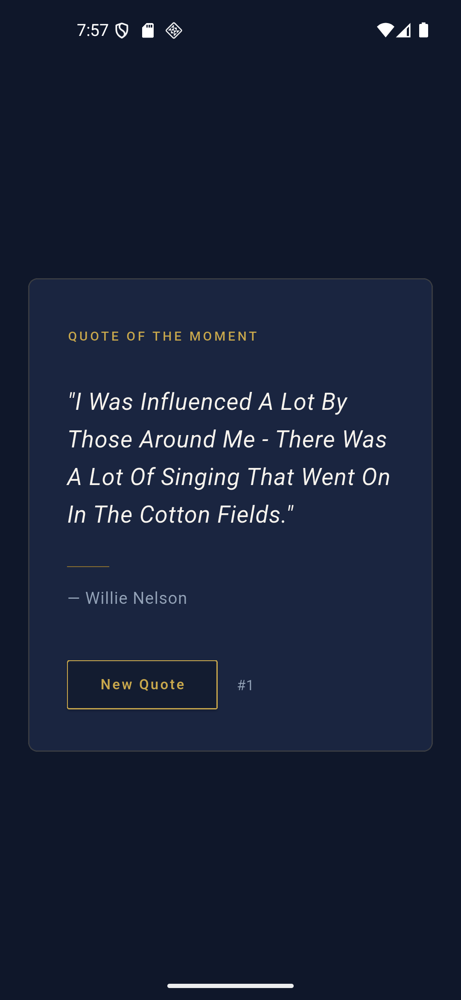
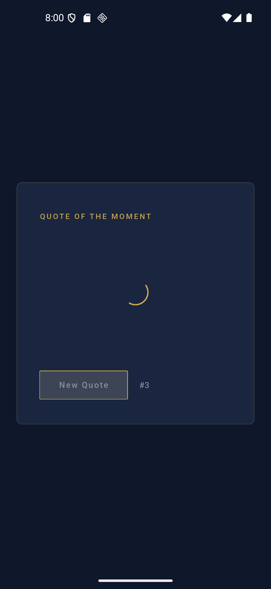

# 📜 Random Quote Generator — Flutter (Clean Architecture)

A simple, polished Flutter app that displays a random inspirational quote on launch and on every button tap — built using **Clean Architecture**, **REST API** integration, and **Provider** state management.

---

## 📸 Screenshots

<p align="center">
  
  
</p>

---

## ✨ Features

- Displays a random quote with author every time the app opens
- "New Quote" button fetches a new random quote on each tap
- Clean, minimal dark/gold UI with smooth fade transitions
- Loading and error states handled gracefully
- Quote counter to track how many quotes you've seen

---

## 🏗️ Architecture

This project follows **Clean Architecture**, separated into three layers:

```
lib/
├── core/                     # Shared utilities used across the app
│   ├── constants/             # API endpoints & config
│   ├── di/                     # Dependency injection (GetIt) setup
│   ├── errors/                 # Failure types for error handling
│   ├── network/                 # Dio HTTP client wrapper
│   └── theme/                   # App colors & theme
│
└── features/
    └── quote/
        ├── domain/             # Business logic — pure Dart, no Flutter/API knowledge
        │   ├── entities/         # Quote entity
        │   ├── repositories/      # Abstract repository contract
        │   └── usecases/           # GetRandomQuote use case
        │
        ├── data/                # Implementation of domain contracts
        │   ├── models/            # QuoteModel (JSON <-> Quote)
        │   ├── datasources/        # Remote data source (Dio API calls)
        │   └── repositories/        # Repository implementation + error mapping
        │
        └── presentation/        # UI layer
            ├── providers/         # QuoteProvider (state management)
            ├── pages/               # QuotePage (main screen)
            └── widgets/              # QuoteCard widget
```

### Why Clean Architecture?

- **Domain layer** has zero dependencies on Flutter, Dio, or JSON — pure business rules.
- **Data layer** implements domain contracts using real tools (REST API via Dio).
- **Presentation layer** only talks to the domain layer through use cases — never directly to the network.

This separation means the API can be swapped (as it was, from Quotable to DummyJSON) by editing **only 2 files**, without touching the UI or business logic.

---

## 🌐 API

This app uses the free, public [DummyJSON Quotes API](https://dummyjson.com/docs/quotes):

```
GET https://dummyjson.com/quotes/random
```

Response:

```json
{
  "id": 1,
  "quote": "Life isn't about getting and having, it's about giving and being.",
  "author": "Kevin Kruse"
}
```

No API key required.

---

## 📦 Packages Used

| Package                                           | Purpose                                                |
| ------------------------------------------------- | ------------------------------------------------------ |
| [`dio`](https://pub.dev/packages/dio)             | HTTP client for REST API calls                         |
| [`get_it`](https://pub.dev/packages/get_it)       | Dependency injection / service locator                 |
| [`provider`](https://pub.dev/packages/provider)   | State management                                       |
| [`dartz`](https://pub.dev/packages/dartz)         | Functional error handling via `Either<Failure, Quote>` |
| [`equatable`](https://pub.dev/packages/equatable) | Value equality for entities & models                   |

---

## 🚀 Getting Started

### Prerequisites

- [Flutter SDK](https://docs.flutter.dev/get-started/install) installed
- An emulator or physical device

### Run the app

```bash
git clone https://github.com/abdelrahmansaed1/<random-quote-generator-flutter>.git
cd <random-quote-generator-flutter>
flutter pub get
flutter run
```

---

## 📱 Screens

| State   | Description                                                  |
| ------- | ------------------------------------------------------------ |
| Loading | Shows a gold circular progress indicator                     |
| Loaded  | Displays quote text, divider, author name, and quote counter |
| Error   | Displays a friendly error message (e.g. connection issues)   |

---

## 🛠️ Built With

- Flutter & Dart
- Clean Architecture (Domain / Data / Presentation)
- Provider for state management
- Dio for networking
- GetIt for dependency injection

---

## 👤 Author

**Abdelrahman Saed**
GitHub: [@abdelrahmansaed1](https://github.com/abdelrahmansaed1)

---

## 📄 License

This project is open source and available for learning purposes.
